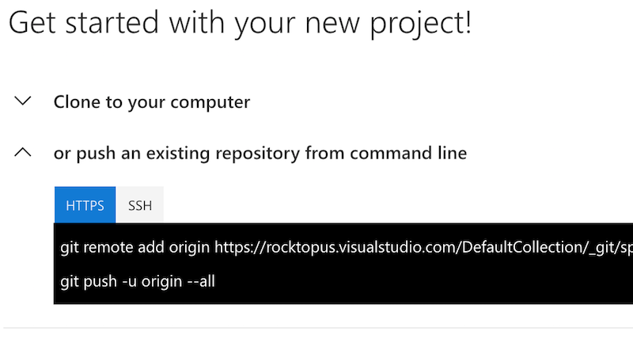

# Put your code into the repo

Simple enough right? I'm assuming you have created your VSTS account and created a new project inside of your account.
If you haven't, check [this](https://docs.microsoft.com/en-us/vsts/user-guide/sign-up-invite-teammates) out (it's pretty easy and likely not worth covering here). One thing to note, you should select `git` as your version control when you create the new project.

Now that you have a project you need to get the code into it. Just like most other services all you need to do is add a remote destination to your git repo:

Now push it. Done. You win.

Move on to [step 2](step2.md) where we start doing cool things.

