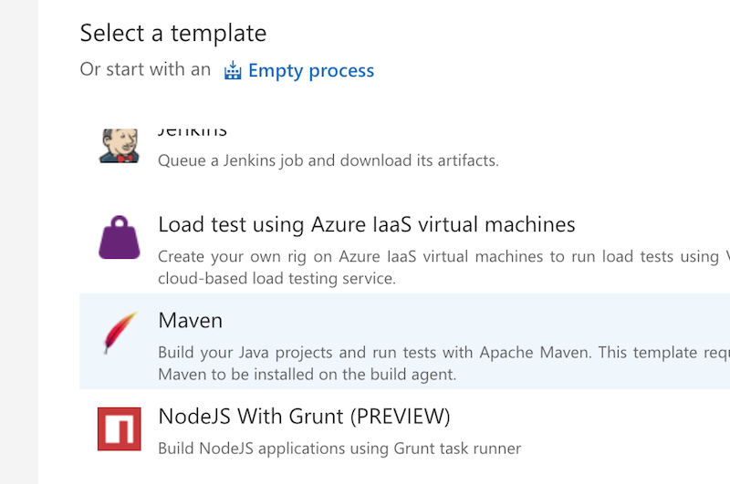
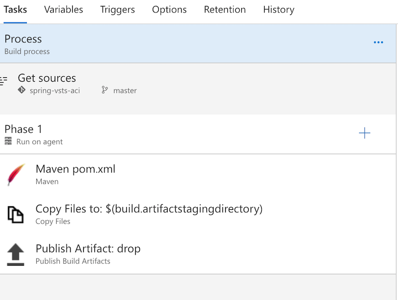
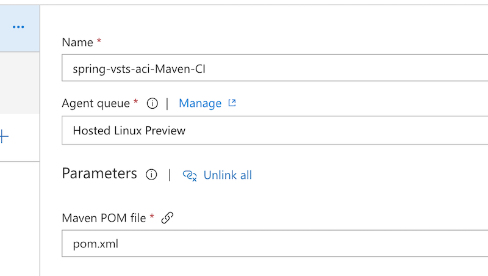
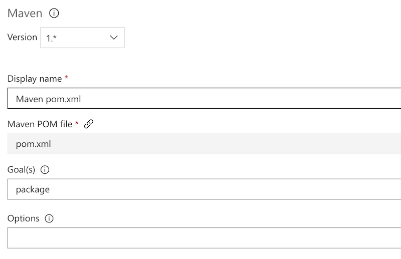
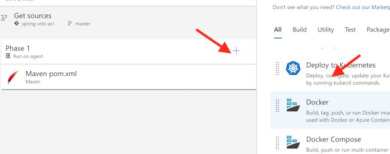

# Build your code

Now the fun stuff begins. VSTS is more than just a code repo, it can also handle your build, testing and deployment processes making it capable of handling a full deployment pipeline.

In this step we're going to create a build process that kicks off every commit and then creates a Docker container which we'll store in our [Azure Container Registry](https://docs.microsoft.com/en-us/azure/container-registry/).

# Create your Azure Container Registry

This is pretty simple so again we'll defer to the [documentation](https://docs.microsoft.com/en-us/azure/container-registry/container-registry-get-started-portal).

# Create a build definition

Back in VSTS go to your project -> "Build and Release" tab -> Builds. You should see an option to create a new definition. If not then this guide is broken and you should submit a PR :).

Go ahead and click on the "new definition" button and you should see a list of pre-defined templates show up. If you've never used VSTS scroll through and take a look at all of the options there are, it's pretty cool. We'll want to use the "Maven" template so click that:

Now things are getting real and you should see a new page with a ton of confusing options so we'll take it one step at a time.

 The first thing we need to do is setup the build agents we want to use. Since we don't want to pay for build agents we are going to use the hosted ones, specifically the Linux ones:

Time to setup the actual build. You *should* see a "Maven pom.xml" section under "Phase 1". If you don't, PR. Go ahead and click on that and a ton of options will be displayed. The only one we **really** care about is the "Goal(s)" field. You'll want to make sure it is set to "package" because at the end of the process we will want a nice tidy jar file.

Feel free to change the display name as the default one isn't that great. If you look around you'll also see that you can integrate your JUnit tests, code coverage tools and code analysis. 

At this point we've actually configured everything we need to do a build and produce a jar file so now we need to create a Docker image. We'll start by removing the two other steps in phase 1 (Copy Files and Publish Artifact).

With those removed we will add in the first Docker step which will create the image

Once you've added that step go ahead and click on it. Again, you can change the display name to whatever you want. Most of the options are self explanatory but the three we really care about are:

* Azure subscription
* Azure Container Registry
* Action

For the Azure subscription offer you can just select the drop-down and pick the subscription you want to use. If you don't see anything click on "Manage" and link your project to your Azure subscription.

Once you have selected your subscription you can pick the Azure Container Registry that you want to use. This should be the one you created earlier.

Action is going to be "Build an image". Easy right?

Take a look at the other options to get an idea on what you can do. The image name and image tag options are something you would probably want to use in a real-world scenario.

At this point VSTS can compile our code and build a container that the code can run in. The next thing we need to do is push our container up to our registry so that we can actually deploy it in Azure.

We'll add another Docker step (just like before) and set the same subscription and Azure Container Registry. This time though, in "Action" we are going to select "Push an image". This is going to take the image that was built in the previous step and push it up into our registry so that we can deploy it in [step 3](step3.md).

Now go ahead and hit "Save" up top and go have an adult beverage (if you are of legal drinking age). Once you are done, proceed to [step 3](step3.md).
