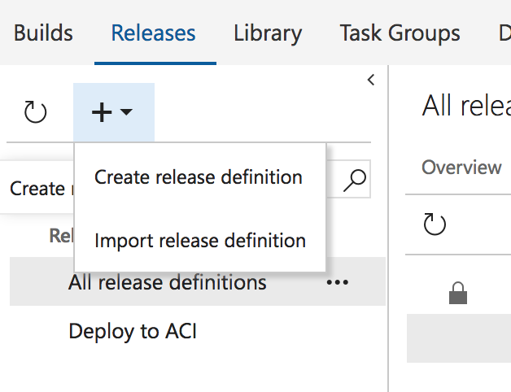
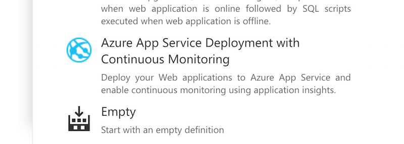
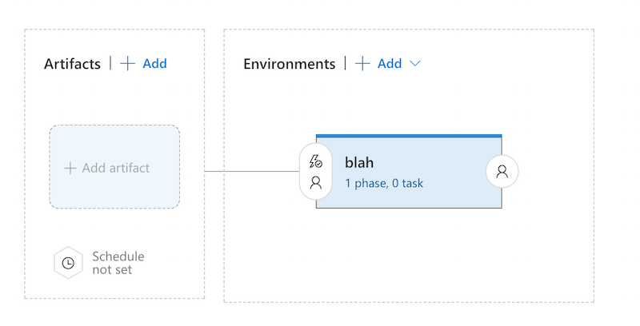
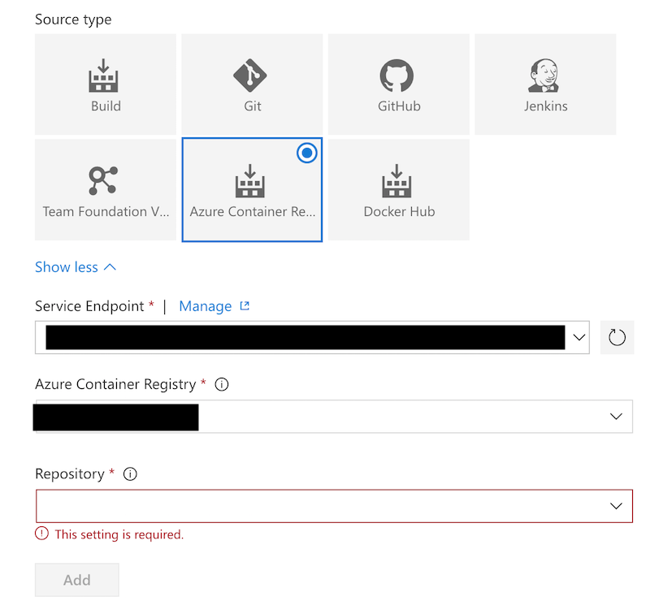
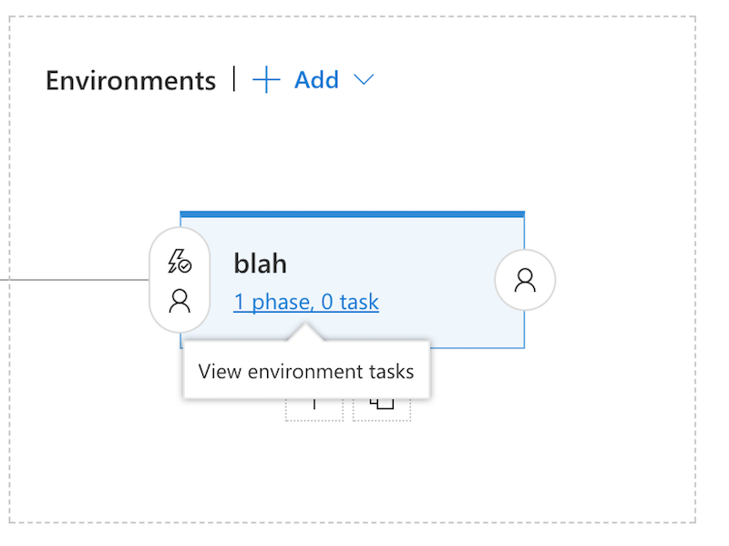
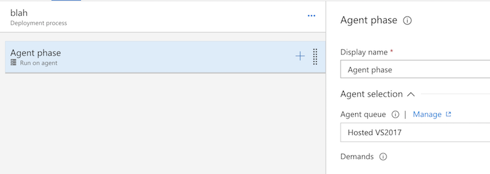
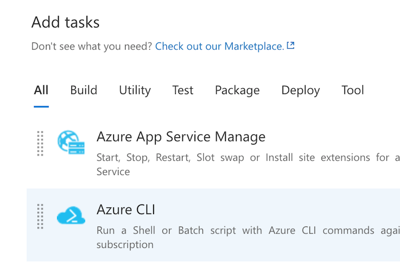
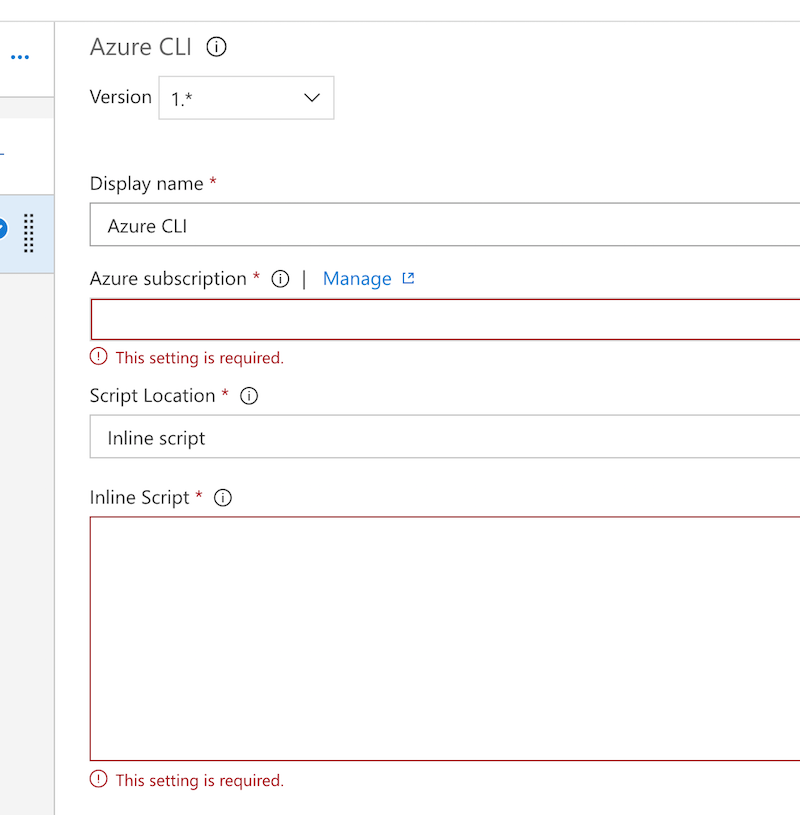
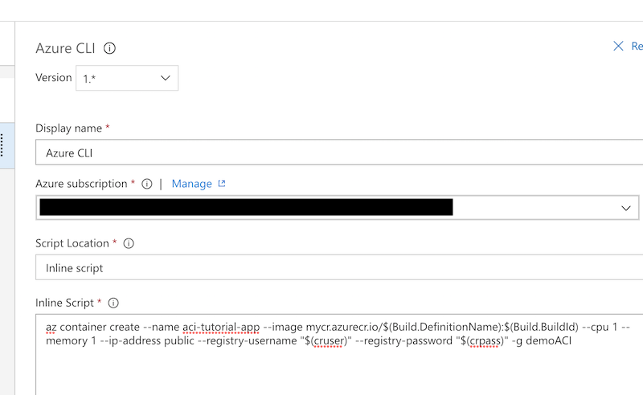

# Release your code

Now that you have a Docker image let's push it out to Azure. For this example we are going to use [Azure Container Instances](https://docs.microsoft.com/en-us/azure/container-instances/). 
Azure container instances are essentially standalone containers that run out on Azure infrastructure without an underlying VM for you to manage. Again, this is a very basic
example so we are not going to deal with mounted volumes, container networking etc.


# Create a release definition

In VSTS you'll want to go to your project -> "Build and Release" tab -> Releases. On the left side you'll see a list of definitions which is likely empty if this is your first time
using VSTS. At the top of the list is a `+` which when you click it you get the option to create a new release definition so go ahead and click that:




This will, like with the build definition, give you a list of templates you can use.
In this case we are going to use the "Empty" template because we are going to do a few things that are not included in any of the templates.




After you select the empty template and apply it you'll get a new window where you get to define your environment. This would play a factor if you were setting up a full blown
deployment pipeline with different environments, but in this case we are just going to deploy to one so name this whatever you want. After you click "Save" you should see something like this: 




The artifacts section would hold just that, artifacts that you want to deploy. In this case we are deploying a Docker container so we are going to use your Azure Container Registry 
as the artifact.



Just plug in your subscription and Azure Container Registry and hit "Add". Now you have an artifact source so feel free to celebrate.


Time to actually release this thing! Back in the template view we are going to click on a very specific part of the page. In the "Environments" section you should see "_ phase, _ task", click on
that.




Similar to our build definition, we now have to pick a group of agents to run our release from. In this case we should use the "Hosted VS2017" because we will need access to the Azure "2.0" CLI.




Again, just like in the build definition we are going to add a task to this agent phase. We are going to use the Azure CLI task in this case




Once you've added the Azure CLI task you are going to see something like this: 



We are going to use an inline script in this example for simplicity but you could just as easily package a script in your code repo for re-use. At this point let's go ahead and save everything 
because we are going to hold off on fleshing out the Azure CLI command as we have to create some variables that will be used in the command.


In order to pull down a container image we need a username and password. To make the process a bit more flexible we'll use variables to hold this data. Another benefit of this is that we can 
obfuscate this data so it isn't printed out in plain text during the deployment process. To do this you'll just click the "Variables" link and add in two variables: one for the username 
and another for the password. If you click the little lock icon this will "encrypt" the data and prevent it from being printed to stdout later. Use whatever variable names you want, just make
sure you remember what they are. Go ahead and click "Save" again and now let's go back to the Azure CLI task.

Previously we said we were going to use an inline script so now let's put that in. The script in this example will look something like this:

```
az container create --name aci-tutorial-app --image mycr.azurecr.io/$(Build.DefinitionName):$(Build.BuildId) --cpu 1 --memory 1 --ip-address public --registry-username "$(cruser)" --registry-password "$(crpass)" -g demoACI
```


This is just a plain Azure CLI command to deploy an Azure Container Instance. The only thing fancy we are doing is plugging in some variables to make this process dynamic and support different 
container names/tags. We do this by using a set of custom variables (container registry user/pass) and built-in variables (build name and ID). The final task will look something like this:




Save all of this and prep yourself for [step 4](step4.md) where we'll actually deploy this mess.
