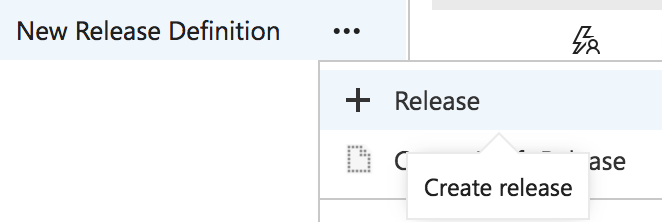
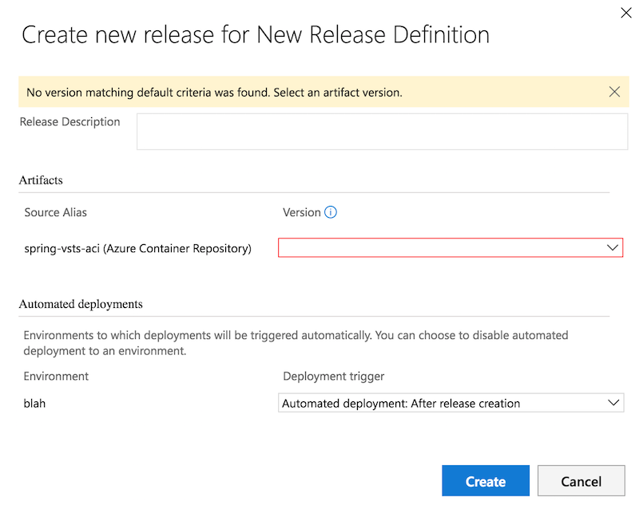
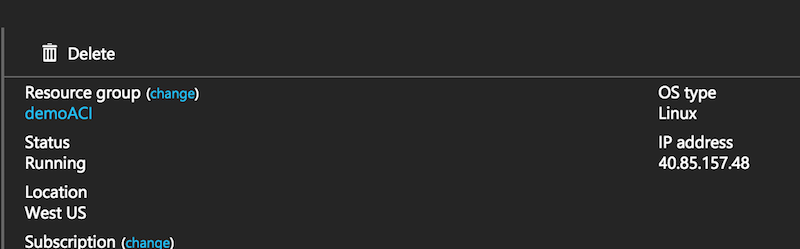
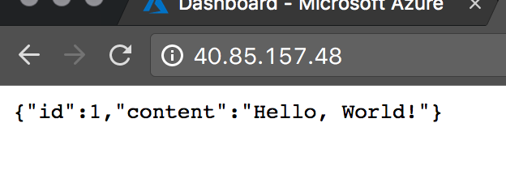

# Actually release your code :)

We have:

* built our code
* built our container with the code in it
* pushed our container to our private registry
* defined how to create this container in Azure

Now it is time to actually get the container started and running in Azure. To make this easy, back in VSTS just click on your project -> "Build and Release" tab -> Releases.
Find your release definition on the left hand side, click the ellipsis and select "Release".

You'll get a window asking you to fill out some info. If you remember back in [step 3](step3.md) we set our Azure Container Registry as the artifact source and here is where it comes into play. 
In this new window you should see an option to select the version. This maps back to the version of the container that we built in [step 2](step2.md). Again, all of this could be automated 
so that you don't have to have a person manually selecting this, but for now we're not worried about that. Go ahead and select the version and click create.

In the previous step we set the release to automatically deploy so after you click "create" VSTS will queue up the release and kick it off. You should see your new release appear in the release window. 
At this point you can click the ellipsis to the right of your release title and do a "open" which will take you to the page showing your actual release. I like to click on the "logs" so that I can
watch the release process but go ahead and explore this section to see what data is presented.

Once the deployment is complete and successful (it was successful right? ;) ), you can go into the Azure portal and then into the resource group you were deploying into. You should see a new
Azure Container Instance which you can then click on. This will show you the public IP of your new container:

Plug that IP into a browser/curl and you'll see the sample app load:

Now that you have the basics down you can go back and setup CI/CD, various environments, etc.
